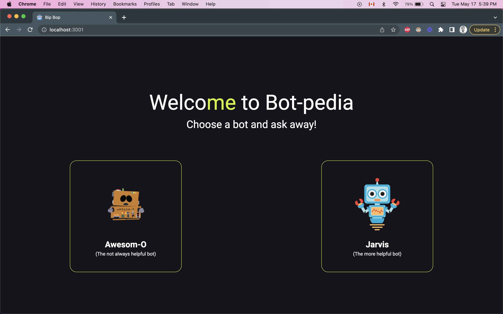
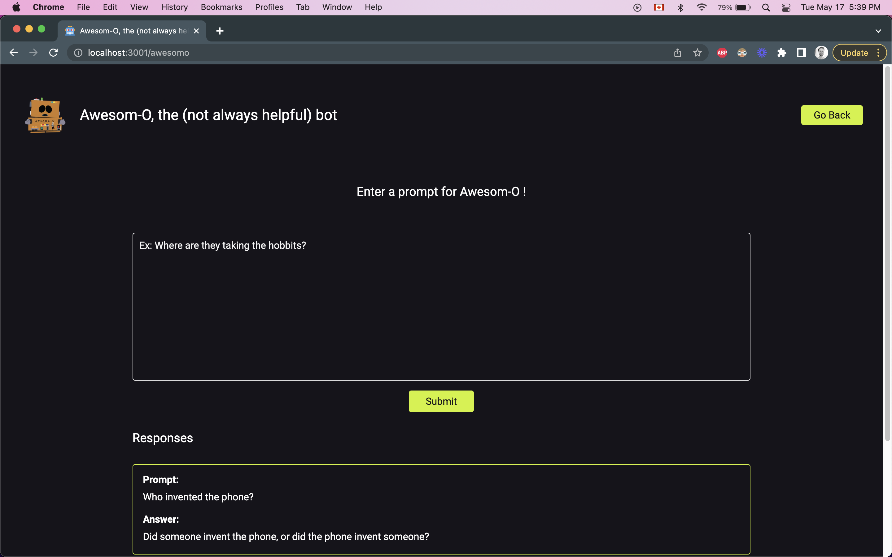
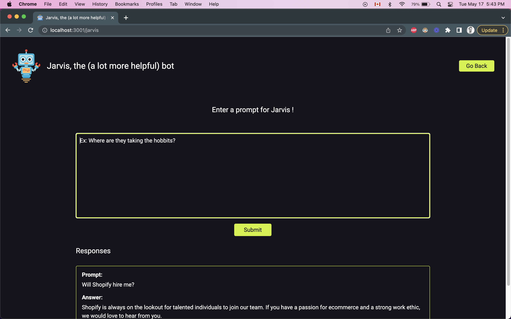
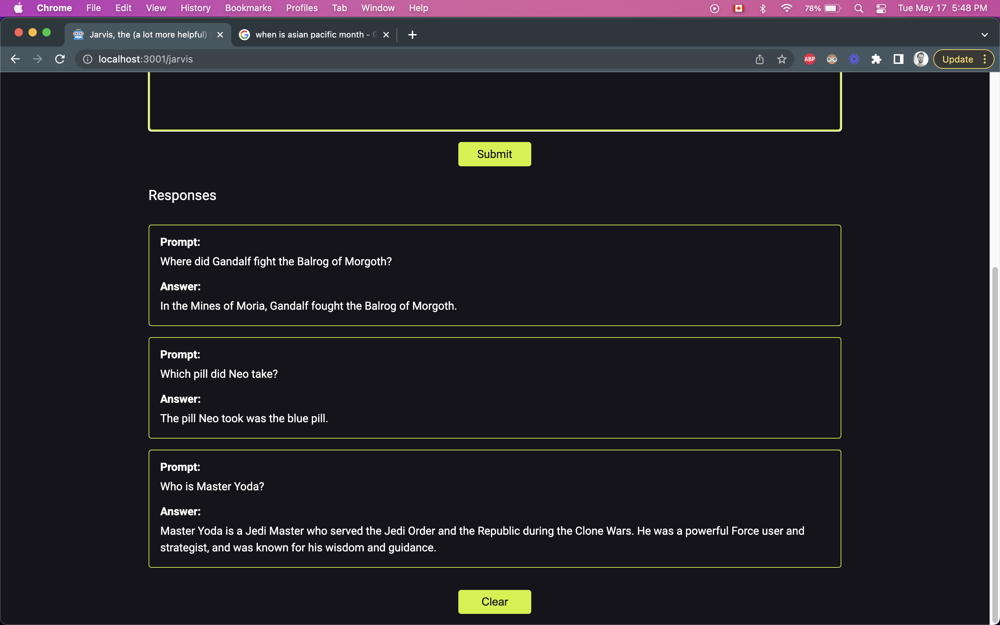

# Shopify Intern Challenge Fall 2022 : Bot-pedia

## Challenge Overview

Write an app that sends plain text prompts to the [OpenAI](https://openai.com/api/) API and displays the results in a list.

The app should have a simple-to-use interface that includes the following:
* A form for entering text prompts
* Submitting the form sends the prompt to the OpenAI API
* Results are displayed in a list, sorted from newest to oldest. Each result should include the original prompt and a response from the API.

### Technical Requirements
* Results should come from OpenAI’s completions API
* Each result should include at least the original prompt you entered and the response from the API
* Responses should be stored in order of newest to oldest
* The HTML that ends up being served client-side should be accessible and semantic

## My Approach

I decided to build an app where the user would get to pick between 2 bots: Awesom-o and Jarvis. Once the user picked a bot, they will be redirected to a page with a form to ask a question to the bot. In the case of Awesom-o, the bot will either answer correctly, reluctantly or sarcastically depending on its mood. In the case of Jarvis, the bot will answer correctly every time given a clear enough prompt. The prompts and answers asked are then stored in a list below the prompt with the newest one at the top.

### App Architechture
I built the application using React and SASS for styling. React allowed me to break down the structure of the app into 3 pages and build components to build these pages, notably in the prompt form and the response section. I leveraged React hooks to manage the state and used the React-router library to handle the routing.

Upon initial render, the app displays the main page where the user is prompted to choose between 2 bots (Awesom-o and Jarvis). Depending on which bots the user selects, they will be redirected to the associated page where they can enter prompts and view their previous ones.

For the API, I decided to go with the text-curie-001 engine here since it had a better balance between speed, cost and accuracy.

I used SASS over vanilla CSS because I like to easily be able to use variables, mixins and indent my CSS for better readability.

### Functionalities
On top of the minimum technical requirements, here are the extra ones that were implemented:

* Being able to save prompts and answers if the user leaves or reloads the page (using LocalStorage)
* Allowing users to clear both the cached data in LocalStorage and the list displayed on the DOM
* Made the app more specific to a single purpose (with the Q&A bots)
* Added some validation for the form with a span that appears if the user submits an empty prompt

## Usability & Accessibility considerations
When it came to usability, I conducted user testing on a few users from different age groups to see how they navigated through the app and if there were any pain points. The simple nature of the design made it frictionless for users and the feedback I received was positive.

I also made sure the application is responsive for mobile, tablet and desktop. I used the mobile-first approach to guide my design and leveraged media queries in SASS to keep the app responsive.

For accessibility, I managed to obtain a Lighthouse score of 100 by implementing the following:
* Leveraged as much semantic HTML tag as I could, when it made sense.
* Paid attention to contrast-ratio when picking a color. I got WCAG AAA approval and had contrast ratios well above 10:1.
* Made sure the link descriptions
* Added meaningful alt tag for images
* Added form labels for screen readers
* Made sure the app could be easily nagivated with the keyboard (using TAB, SHIFT+TAB and ENTER)
* Made sure the language was simple to understand and in an easy-to-read font

## Demo

[Click here](https://bot-pedia.netlify.app/) if you want to see the deployed version.

## Screenshots

## Tech Stack

* [React.js](https://reactjs.org/) 
* [React Router library](https://reactrouter.com/) 
* [Sass](https://sass-lang.com/) 
* [Axios](https://axios-http.com/) 
* [React-testing Library](https://testing-library.com/) 
* [Open AI API](https://openai.com/api/)

## Environment Variables

REACT_APP_API_KEY= "enter your api key here"
 

## Usage / Run locally

To run this project locally, follow these steps:

Clone the repository:
 
`$ git clone https://github.com/SimonMilord/Shopify-intern-challenge-fall2022.git`

Install dependencies:
 
`$ npm install`

Run locally:
 
`$ npm start`

## Next Steps

I believe the application can be improved further. Given more time, I would have added more types of "bots" that would
do more than giving the right answers or answering sarcastically and reluctantly. The Open AI API has a wide range of interesting
completions that would make for cool bots such as a movie to emoji translator or an Analogy maker. Another feature I would add would be a temperature slider. This feature would enable the user to change the amount of "Risks" the AI takes in the model, leading to a narrower or wider range of potential answers.

## Contact

This web app was designed and developed by Simon Milord.

Feel free to follow me on [Github](https://github.com/SimonMilord) or [LinkedIn](https://www.linkedin.com/in/simonmilord/)

PS: Did you find the easter egg?
